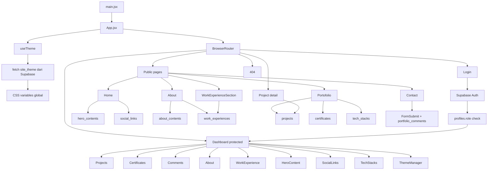

# Struktur Project & Flow Data - Asutrisna.Porto

Dokumen ini merangkum struktur utama project portfolio Asutrisna.Porto, alur render aplikasi, sumber data yang dipakai di website publik, serta alur update konten dari dashboard admin.

## 1. Gambaran Umum

Project ini adalah website personal portfolio berbasis React + Vite dengan backend data memakai Supabase. Konten publik tidak disimpan hardcoded sepenuhnya, tetapi banyak dibaca dari tabel Supabase agar dapat diubah secara dinamis lewat dashboard admin.

Komponen besar project:
- Website publik: landing page, about, portfolio, project detail, contact, login
- Dashboard admin: CRUD konten portfolio, komentar, theme, dan konten halaman lain
- Supabase: authentication, database, storage, dan realtime update
- Static/SEO pipeline: sitemap, robots, verifikasi Google, dan metadata

## 2. Struktur Folder Utama

```text
.
├── index.html
├── package.json
├── vite.config.js
├── tailwind.config.js
├── postcss.config.js
├── eslint.config.js
├── vercel.json
├── README.md
├── scripts/
│   └── generate-sitemap.mjs
├── public/
│   ├── robots.txt
│   ├── sitemap.xml
│   ├── google69971c601d2409b3.html
│   ├── Coding.json
│   └── Lottie.json
├── src/
│   ├── main.jsx
│   ├── App.jsx
│   ├── index.css
│   ├── supabase.js
│   ├── assets/
│   ├── components/
│   │   ├── Background.jsx
│   │   ├── Navbar.jsx
│   │   ├── Footer.jsx
│   │   ├── ProtectedRoute.jsx
│   │   ├── ProjectDetail.jsx
│   │   ├── Commentar.jsx
│   │   ├── CardProject.jsx
│   │   ├── Certificate.jsx
│   │   ├── SocialLinks.jsx
│   │   ├── WorkExperienceSection.jsx
│   │   └── ...
│   ├── hooks/
│   │   ├── useTheme.js
│   │   └── useToast.js
│   ├── Pages/
│   │   ├── Home.jsx
│   │   ├── About.jsx
│   │   ├── Portofolio.jsx
│   │   ├── Contact.jsx
│   │   ├── Login.jsx
│   │   ├── Dashboard.jsx
│   │   ├── 404.jsx
│   │   └── dashboard/
│   │       ├── Projects.jsx
│   │       ├── Certificates.jsx
│   │       ├── Comments.jsx
│   │       ├── About.jsx
│   │       ├── WorkExperience.jsx
│   │       ├── WorkExperiences.jsx
│   │       ├── HeroContent.jsx
│   │       ├── SocialLinks.jsx
│   │       ├── TechStacks.jsx
│   │       ├── ThemeManager.jsx
│   │       └── components/
│   │           ├── ThemePresetSection.jsx
│   │           ├── PresetCardsGrid.jsx
│   │           ├── PresetCard.jsx
│   │           ├── PresetFilterTabs.jsx
│   │           ├── ApplyPresetModal.jsx
│   │           └── ColorBar.jsx
│   └── utils/
│       ├── themeManager.js
│       ├── seoSchema.js
│       ├── slug.js
│       ├── projectImages.js
│       └── workExperiences.js
└── supabase/
    ├── hero_contents/
    └── migrations/
```

## 3. Arsitektur Runtime



## 4. Flow Data Website Publik

### 4.1 Bootstrap Aplikasi

- [src/main.jsx](src/main.jsx) hanya menempelkan <App /> ke root DOM.
- [src/App.jsx](src/App.jsx) mengatur seluruh routing.
- [src/hooks/useTheme.js](src/hooks/useTheme.js) dipanggil saat aplikasi mulai untuk mengambil theme dari Supabase dan menulis CSS variables global.
- [src/components/Background.jsx](src/components/Background.jsx) membaca CSS variables itu untuk efek background.

### 4.2 Home / Landing Page

File utama:
- [src/Pages/Home.jsx](src/Pages/Home.jsx)

Flow data:
1. Home mengambil data hero dari tabel `hero_contents`.
2. Home juga mengambil data social link dari tabel `social_links`.
3. Data dipakai untuk hero text, CTA, badge, gambar, dan schema SEO.
4. Jika data kosong, beberapa bagian memakai fallback lokal.
5. Schema SEO dibangun lewat utility di [src/utils/seoSchema.js](src/utils/seoSchema.js).

### 4.3 About Page

File utama:
- [src/Pages/About.jsx](src/Pages/About.jsx)

Flow data:
1. Konten utama About diambil dari tabel `about_contents` dengan filter published.
2. Work experience diambil dari tabel `work_experiences`.
3. Jumlah project dan certificate dibaca dari `localStorage` sebagai cache/fallback.
4. CV bisa berasal dari URL biasa atau Supabase Storage; jika URL Storage terdeteksi, file dibuat signed URL dulu sebelum diunduh.

### 4.4 Work Experience Section

File utama:
- [src/components/WorkExperienceSection.jsx](src/components/WorkExperienceSection.jsx)

Flow data:
1. Komponen membaca `work_experiences` dari Supabase.
2. Data dinormalisasi dengan utility di [src/utils/workExperiences.js](src/utils/workExperiences.js).
3. Hasilnya disimpan ke `localStorage` untuk fallback saat request gagal.
4. Jika tidak ada data, UI menampilkan state kosong.

### 4.5 Portfolio Showcase

File utama:
- [src/Pages/Portofolio.jsx](src/Pages/Portofolio.jsx)

Flow data:
1. Data project diambil dari tabel `projects`.
2. Data sertifikat diambil dari tabel `certificates`.
3. Data skill/teknologi aktif diambil dari tabel `tech_stacks` dengan filter `is_active = true`.
4. Hasil fetch disimpan ke `localStorage` sebagai cache.
5. Jika database tidak tersedia, komponen memakai fallback statis untuk tech stack.
6. Project card dan certificate card kemudian dirender dalam tab showcase.

### 4.6 Project Detail Page

File utama:
- [src/components/ProjectDetail.jsx](src/components/ProjectDetail.jsx)

Flow data:
1. URL memakai slug, misalnya `/project/:slug`.
2. Komponen mengambil semua project dari tabel `projects`.
3. Project yang cocok dicari berdasarkan slug hasil utility [src/utils/slug.js](src/utils/slug.js).
4. Jika tidak ketemu di Supabase, komponen mencoba `localStorage`.
5. Image project dinormalisasi lewat [src/utils/projectImages.js](src/utils/projectImages.js).
6. SEO schema dibangun ulang untuk halaman detail project.

### 4.7 Contact Page + Komentar Visitor

File utama:
- [src/Pages/Contact.jsx](src/Pages/Contact.jsx)
- [src/components/Commentar.jsx](src/components/Commentar.jsx)

Flow data contact:
1. Form contact mengirim pesan ke FormSubmit, bukan ke Supabase.
2. Payload berisi name, email, dan message.
3. Setelah submit, UI menampilkan notifikasi sukses/gagal.

Flow data komentar:
1. Visitor mengirim komentar dari komponen komentar.
2. Jika user menambahkan foto profil, file diupload ke Supabase Storage bucket `profile-images`.
3. Setelah upload sukses, komentar disimpan ke tabel `portfolio_comments`.
4. Komentar pinned diambil terpisah dari komentar biasa.
5. Komentar biasa disubscribe realtime, jadi perubahan di Supabase langsung memicu refresh UI.

## 5. Flow Data Dashboard Admin

### 5.1 Login dan Proteksi Route

File utama:
- [src/Pages/Login.jsx](src/Pages/Login.jsx)
- [src/components/ProtectedRoute.jsx](src/components/ProtectedRoute.jsx)
- [src/Pages/Dashboard.jsx](src/Pages/Dashboard.jsx)

Flow:
1. Admin login memakai Supabase Auth.
2. Setelah login, aplikasi membaca tabel `profiles` untuk memastikan `role === 'admin'`.
3. [src/components/ProtectedRoute.jsx](src/components/ProtectedRoute.jsx) mengecek sesi dan role lagi sebelum membuka `/dashboard/*`.
4. Jika tidak lolos, user diarahkan kembali ke `/login`.
5. Logout dilakukan dengan `supabase.auth.signOut()`.

### 5.2 Struktur Menu Dashboard

Dashboard utama berfungsi sebagai shell navigasi untuk modul berikut:
- Projects
- Work Experience
- Hero Content
- About
- Tech Stack
- Social Media
- Certificates
- Comments
- Theme Manager

### 5.3 Alur CRUD Konten

Setiap modul dashboard membaca dan menulis ke tabel Supabase yang berbeda:

| Modul Dashboard | Tabel Supabase | Fungsi Utama |
|---|---|---|
| Projects | `projects` | CRUD project portfolio |
| Certificates | `certificates` | Upload dan hapus sertifikat |
| Comments | `portfolio_comments` | Moderasi komentar visitor |
| About | `about_contents` | Kelola konten halaman About |
| Work Experience | `work_experiences` | Kelola riwayat kerja |
| Hero Content | `hero_contents` | Kelola isi hero landing page |
| Social Links | `social_links` | Kelola link sosial media |
| Tech Stacks | `tech_stacks` | Kelola daftar teknologi |
| Theme Manager | `site_theme` | Kelola warna dan efek visual |

## 6. Flow Theme dan UI Global

File utama:
- [src/utils/themeManager.js](src/utils/themeManager.js)
- [src/hooks/useTheme.js](src/hooks/useTheme.js)
- [src/components/Background.jsx](src/components/Background.jsx)
- [src/Pages/dashboard/ThemeManager.jsx](src/Pages/dashboard/ThemeManager.jsx)

Flow:
1. `site_theme` menyimpan warna global website.
2. [src/utils/themeManager.js](src/utils/themeManager.js) membaca, mengubah, dan mereset data theme.
3. [src/hooks/useTheme.js](src/hooks/useTheme.js) mengambil data theme lalu menyuntikkan CSS variables ke `document.documentElement`.
4. Background, button, card, text, border, dan form di halaman publik membaca CSS variables tersebut.
5. [src/Pages/dashboard/ThemeManager.jsx](src/Pages/dashboard/ThemeManager.jsx) menyediakan UI untuk mengganti warna secara langsung.
6. Update theme juga didukung realtime subscription, sehingga perubahan bisa terasa hampir langsung di UI.

## 7. Data Cache dan Fallback

Project ini memakai kombinasi Supabase dan `localStorage` untuk menjaga UI tetap cepat dan tetap bisa tampil saat request gagal.

Pola yang umum:
- Data utama diambil dari Supabase
- Hasil fetch disimpan ke `localStorage`
- Saat fetch gagal, data cache dipakai sebagai fallback
- Jika cache kosong, komponen menampilkan state kosong atau data default

Komponen yang memakai pola ini:
- Portfolio showcase
- About page
- Project detail
- Work experience section
- Theme loading

## 8. Static Asset dan SEO Pipeline

Halaman dan file pendukung:
- `public/robots.txt`
- `public/sitemap.xml`
- `public/google69971c601d2409b3.html`
- `scripts/generate-sitemap.mjs`
- `vercel.json`

Fungsi pipeline ini:
- Sitemap dibuat otomatis saat `dev` dan `build`
- Robots dan sitemap mendukung crawling SEO
- File verifikasi Google disediakan di `public/`
- Metadata halaman dibantu oleh `react-helmet-async` dan utility schema di `src/utils/seoSchema.js`

## 9. Ringkasan Alur Besar

Secara sederhana, alurnya seperti ini:

1. React boot dari [src/main.jsx](src/main.jsx).
2. [src/App.jsx](src/App.jsx) mengaktifkan theme, router, dan layout global.
3. Halaman publik membaca konten dinamis dari Supabase.
4. Visitor dapat mengirim komentar dan pesan contact.
5. Admin login lewat Supabase Auth lalu masuk dashboard.
6. Admin mengubah konten melalui CRUD di dashboard.
7. Update data disimpan ke Supabase dan sebagian disinkronkan ke realtime UI.
8. Theme global, SEO, dan asset statis mendukung tampilan dan indexing website.

## 10. File Inti Untuk Referensi Cepat

- [src/App.jsx](src/App.jsx)
- [src/main.jsx](src/main.jsx)
- [src/supabase.js](src/supabase.js)
- [src/Pages/Home.jsx](src/Pages/Home.jsx)
- [src/Pages/About.jsx](src/Pages/About.jsx)
- [src/Pages/Portofolio.jsx](src/Pages/Portofolio.jsx)
- [src/Pages/Contact.jsx](src/Pages/Contact.jsx)
- [src/Pages/Login.jsx](src/Pages/Login.jsx)
- [src/Pages/Dashboard.jsx](src/Pages/Dashboard.jsx)
- [src/components/ProtectedRoute.jsx](src/components/ProtectedRoute.jsx)
- [src/components/Commentar.jsx](src/components/Commentar.jsx)
- [src/utils/themeManager.js](src/utils/themeManager.js)
- [src/hooks/useTheme.js](src/hooks/useTheme.js)
